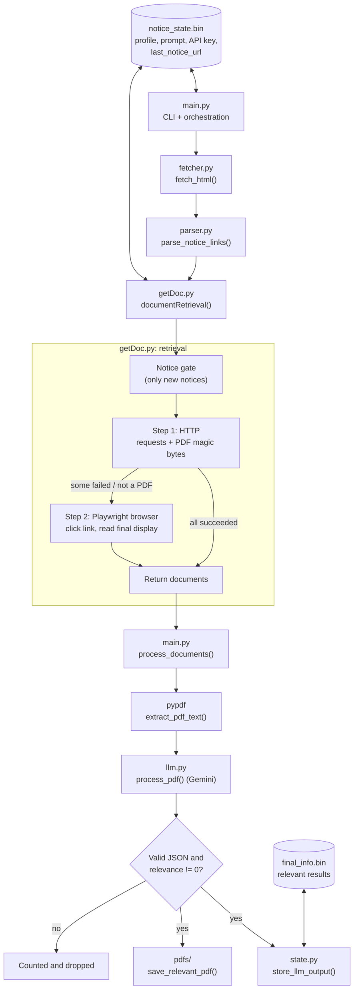
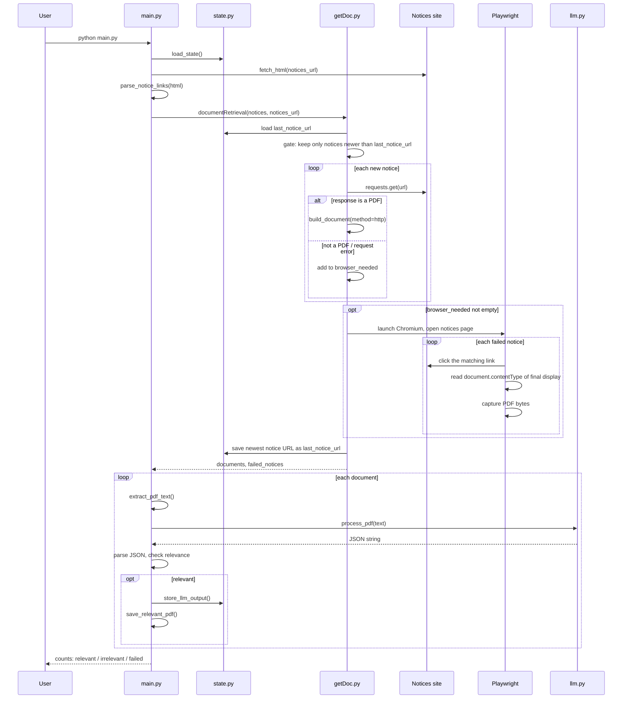

# noticeLens Architecture

noticeLens is a single-process Python CLI that turns a college notices page into a short list of structured, student-specific events. It is a **fixed sequential pipeline** with one LLM call per document. It is not an agent: the model never chooses actions, it only classifies and extracts.

---

## 1. System overview



### Module responsibilities

| Module | Responsibility |
|---|---|
| `main.py` | CLI entry point and command routing. Orchestrates one full run (`check_for_new_notices`), PDF text extraction, per-document LLM processing, relevance decision and saving relevant PDFs. |
| `fetcher.py` | Fetches the notices page HTML. |
| `parser.py` | Parses the HTML into an ordered list of notices, each with a `name` and `url`. Newest first. |
| `getDoc.py` | Everything between "a list of notice URLs" and "a list of PDF bytes": the notice gate, HTTP retrieval, and the Playwright fallback. |
| `llm.py` | Sends the extracted text, the prompt and the student profile to the LLM and returns its raw JSON string. |
| `state.py` | Persistence: default state, load/save/clear, final results storage, PDF directory. |

The core pipeline (`getDoc`, `llm`, `state`) has no knowledge of any specific college site. Site-specific behaviour lives in the parser.

---

## 2. End-to-end run

One run is triggered by `python main.py` (or `python main.py notices check`).



---

## 3. Stage details

### 3.1 Notice discovery (`fetcher.py`, `parser.py`)

- The notices page HTML is fetched and parsed into notice entries (`{"name", "url"}`), preserving page order.
- Order matters: the gate treats the first entry as the newest.
- Parsing is the only site-specific stage. Tested on the NSUT (`imsnsit.org`) and IIT Delhi (`academics.iitd.ac.in/circulars`) pages.

### 3.2 Notice gate (`getDoc.py`)

The gate prevents reprocessing old notices. The identity of a notice is **the URL found on the notices page**, not the final PDF URL after redirects, because redirect targets can change per session.

| Situation | Behaviour |
|---|---|
| First run (no `last_notice_url`) | Process all supplied notices. |
| `last_notice_url` found in the list | Process only the notices above it (newer ones). |
| `last_notice_url` missing from the list | Process **nothing**. The tool cannot tell where the new notices end, so it avoids reprocessing old documents. |
| Duplicate URLs in one scrape | Deduplicated. |

The newest notice URL is saved **after** retrieval attempts. A notice that fails retrieval is therefore still marked as checked and is **not** retried automatically. It is reported with a reason instead.

Each notice is also tagged with its occurrence number among notices sharing the same name, so duplicate-named links can be matched to the right element later in the browser.

### 3.3 Document retrieval (`getDoc.py`)

Retrieval is two-tier: cheap and fast first, realistic and slower second.

**Step 1: HTTP**

- `requests.get` with a browser-like `User-Agent`, 15s timeout, redirects allowed.
- Success means the bytes contain `%PDF-` within the first 1024 bytes (`is_pdf_bytes`). The content type header is recorded but not trusted.
- Anything else (HTTP error, timeout, non-PDF response such as an HTML viewer page) goes to the browser queue.
- If every notice succeeds, the browser is never launched.

**Step 2: Browser (Playwright, Chromium)**

For each failed notice the browser finds the link on the notices page by name and occurrence and clicks it like a user. It then judges only what the browser ends up displaying:

1. Click the link (10s timeout). A failed click is reported as `click_failed`.
2. Wait for the browser to react: a new tab opens, or the current page navigates. The last opened tab (or the current page) is the "final display".
3. For a new tab, wait for it to leave `about:blank`, then wait for the page to load.
4. Read `document.contentType` of the final display. If it is not `application/pdf`, stop with `display_not_pdf`.
5. Obtain the bytes, in order of preference:
   1. The browser's own navigation response for the final URL. This is exactly what the browser received, so it works for session-bound or one-time URLs.
   2. Fallback: re-request the final URL through the browser context (same cookies), with the notices page as `Referer`.
6. Confirm the bytes are a PDF. Otherwise report `bytes_not_pdf`.
7. Always close tabs opened by the click and remove event listeners.

Link discovery ignores links inside `header`, `nav`, `footer` and `aside`, plus `mailto:`, `tel:`, `javascript:` and `#` hrefs.

**Output of retrieval**

Each document is a dictionary:

```python
{
  "source_url":       # URL from the notices page (identity)
  "name":             # link text
  "final_url":        # where the PDF actually came from
  "content":          # raw PDF bytes
  "content_type":
  "is_pdf":           True,
  "has_eof":          # cheap completeness hint (%%EOF near the end)
  "retrieval_method": "http" | "browser",
}
```

Failures are returned separately as `{"name", "url", "reason"}`.

### 3.4 AI processing (`main.py`, `llm.py`)

Each document is processed **independently**, inside its own try/except, so one bad file never stops the run.

1. `extract_pdf_text` reads every page with `pypdf`. Documents with no extractable text are counted as failed.
2. `llm.process_pdf(text)` sends the text, the stored prompt and the student profile to the LLM and returns a raw string.
3. The string is parsed as JSON. Invalid JSON means the document is not stored and is counted as failed.
4. `relevance` must convert to a number. Otherwise the document is counted as failed.
5. `relevance == 0` means irrelevant: counted and dropped. Anything else is relevant.
6. For relevant documents, the raw LLM output is appended to `final_info.bin` and the PDF is saved into `pdfs/` using the model's suggested filename, sanitised and made unique.

### 3.5 Prompt design (`state.py` -> `DEFAULT_STATE["prompt"]`)

The prompt is stored in state and editable at runtime with `python main.py prompt set`. It has four parts:

| Part | Purpose |
|---|---|
| Role | A personal assistant for a very busy student who only wants notices that apply to them. |
| Relevance meter | A score from 0 to 1 judged against the student profile and the notice. Below 0.5 is treated as 0. Instructions say not to count a notice as relevant just because the student's institute issued it, to judge real applicability and scope, to allow large open events hosted elsewhere, and to consider the current date and time. |
| Strict output schema | A single JSON object with no extra text: relevance, suggested filename, event (name, location, registration window, event start and end, category, sub-category) and summary (objective, important people, scope). |
| Category definitions | Definitions and examples of category and sub-category, so labels are consistent across notices. |

The thresholding rule (below 0.5 becomes 0) lives in the prompt, and the code only checks `!= 0`. This keeps the decision boundary editable without changing code.

### 3.6 State and storage (`state.py`)

| File | Contents |
|---|---|
| `notice_state.bin` (pickle) | `student_profile`, `api_key`, `prompt`, `last_notice_url` |
| `final_info.bin` (pickle) | List of `{"result": <raw LLM JSON string>}` for relevant notices |
| `pdfs/` | Saved copies of relevant PDFs |

- `load_state` fills in missing profile and application fields, so older state files remain compatible.
- Unreadable or invalid state files fall back to a fresh default state instead of crashing.
- Results are stored exactly as returned by the model, because the output format is controlled by the user-editable prompt.

Student profile fields: `name, institute, course, branch, year, semester, section, roll_number, interests, notices_url`.

---

## 4. Failure handling

| Failure | Where | Behaviour |
|---|---|---|
| Notices page cannot be fetched | `main.py` | Run stops with a message. Nothing is saved. |
| No notice links parsed | `main.py` | Run stops with a message. |
| HTTP error or non-PDF response | `getDoc.py` | Falls back to the browser. |
| Click fails, link not found, display is not a PDF, bytes are not a PDF | `getDoc.py` | Reported in `failed_notices` with a reason. Not retried automatically. |
| Browser cannot open the notices page | `getDoc.py` | All pending notices reported as `homepage_unavailable`. `last_notice_url` is **not** advanced, so they are checked again next run. |
| PDF has no extractable text | `main.py` | Counted as failed. |
| LLM returns invalid JSON or an invalid relevance | `main.py` | Counted as failed, nothing stored. |
| Any other exception on one document | `main.py` | Logged, counted as failed, next document continues. |

Every run ends with a summary of relevant, irrelevant and failed counts, plus a list of retrieval failures.

---

## 5. CLI surface

```
python main.py                         Run the pipeline
python main.py notices [check|show|set <url>]
python main.py profile [show|edit|set <field> <value>]
python main.py prompt  [show|set]      (finish input with a line containing END-)
python main.py api-key [show|set <key>|clear]
python main.py last-url [show|set <url>|clear]
python main.py final   [show|clear]
python main.py state   [show|clear]    (clear needs two CLEAR confirmations)
python main.py help
```

The CLI makes every piece of configuration (profile, prompt, notices URL, API key, gate position) inspectable and resettable without touching code.

---

## 6. Design decisions

| Decision | Reason |
|---|---|
| Fixed pipeline, not an agent | The task is well-defined, and deterministic control flow is cheaper, faster and easier to debug. |
| HTTP first, browser second | HTTP is fast and needs no browser. The browser handles the cases college sites actually produce: redirects, viewer pages, new tabs and session-bound links. |
| Judge the final display, not network traffic | What the user would see (`document.contentType`) is more reliable than inferring from intermediate requests. |
| Notice identity is the page URL | Final PDF URLs can change per session or redirect. The page URL is stable. |
| Gate fails closed | If the old marker is gone, process nothing. Better to miss a run than to flood the student with old notices. |
| One LLM call per document | Failures are isolated, and each document gets the full context window. |
| Prompt in state, not in code | The relevance behaviour can be tuned per student without a code change. |
| Store raw LLM output | The output format belongs to the user-editable prompt, so the storage layer stays format-agnostic. |
| Local pickle state | Zero setup for a single-user CLI tool. |

---

## 7. Security and privacy

- All state is stored locally. The notice text is sent to the LLM provider as part of processing.
- The API key is stored in `notice_state.bin` without encryption. Keep that file (and `final_info.bin`, `pdfs/`) out of version control.
- Pickle files must only be loaded from a trusted location, since unpickling untrusted data can execute code. Do not share state files with others.
- The tool is read-only toward the student's institute. It does not log in, register or submit anything on the student's behalf.

---

## 8. Extension points

| To add | Change |
|---|---|
| Another college's notices page | Adjust or add a parser for its HTML. The rest of the pipeline is unchanged. |
| Another LLM provider | Replace `llm.process_pdf`. It only needs to accept text and return the JSON string. |
| Another document format (DOCX, images) | Add an extractor next to `extract_pdf_text` and relax `is_pdf_bytes`. |
| Different output fields | Edit the prompt schema. Storage stores whatever is returned. |
| Different delivery (calendar, email, web UI) | Read from `final_info.bin` or hook in after `store_llm_output`. |
| Scheduled runs | Run `python main.py` from cron or Task Scheduler. The gate makes repeated runs safe. |

---

## 9. Known limitations

- PDF only. Image-only notices need extra handling.
- Parsing is tuned to tested pages. Unusual layouts may need parser changes.
- Failed retrievals are not retried automatically, by design of the gate.
- The browser runs visibly (`headless=False`) by default, so it is not suited to a server without a display unless `headless=True` is passed.
- Single user, single notices page, local storage only.